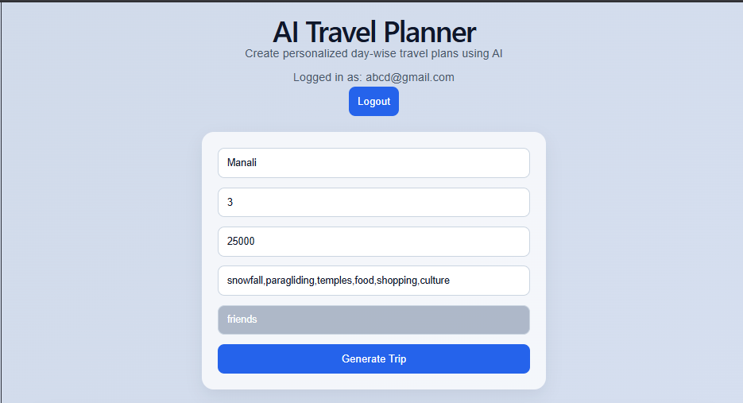
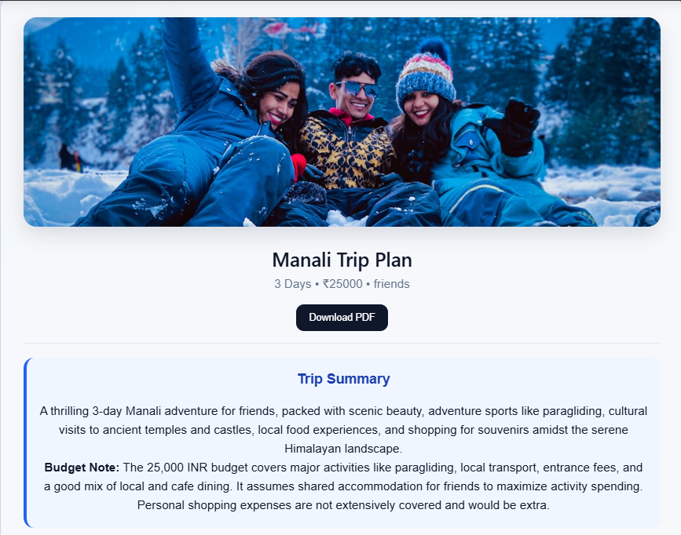
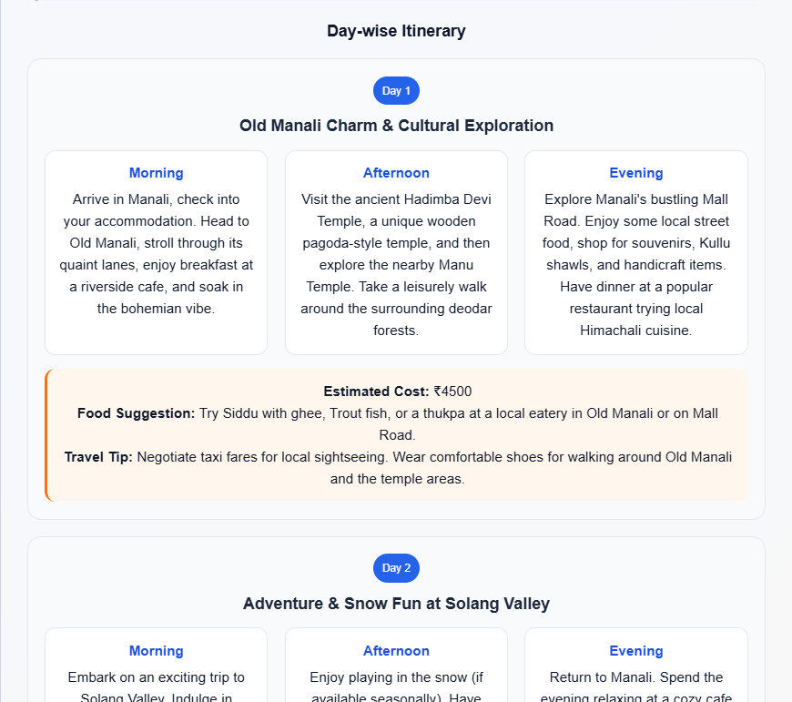
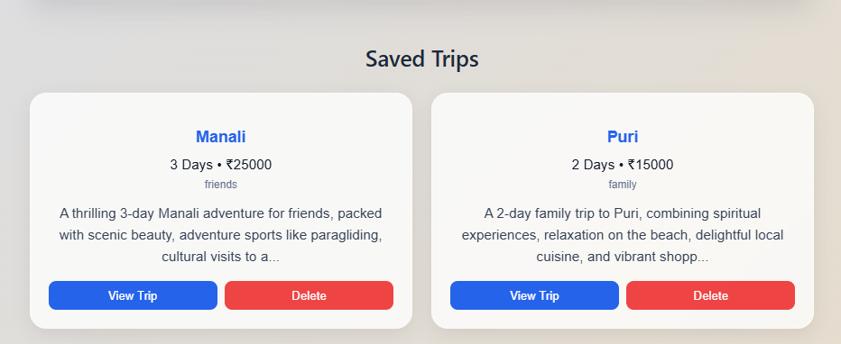

# ✈️ AI Travel Planner

An intelligent full-stack AI-powered travel planning platform that generates personalized day-wise itineraries using Google Gemini AI.

The application combines:
- Generative AI
- Cloud Databases
- Authentication Systems
- REST APIs
- Responsive UI/UX


to deliver a modern real-world travel planning experience.

---

# 🌟 Project Highlights

## 🚀 What Makes This Project Unique?

Unlike basic travel itinerary generators, this platform provides:

✅ AI-generated personalized itineraries  
✅ Budget-aware recommendations  
✅ Travel-type customization  
✅ Firebase Authentication  
✅ MongoDB cloud storage  
✅ PDF itinerary downloads  
✅ Weather integration  
✅ Dynamic destination images  
✅ User-specific saved trips  
✅ Modern responsive UI  

This project demonstrates practical implementation of Large Language Models (LLMs) in a production-style application.

---

# 🏠 Home Page

The homepage allows users to:
- Enter destination
- Select trip duration
- Set budget
- Add interests
- Choose travel type

Users can instantly generate personalized itineraries using AI.



---

# 🤖 AI-Powered Itinerary Generation

The core feature uses Google Gemini AI to generate:

- Day-wise travel plans
- Food recommendations
- Local exploration suggestions
- Travel tips
- Budget recommendations

The AI adapts responses dynamically based on:
- Destination
- Budget
- Interests
- Travel duration
- Travel type

---

# 📸 AI Generated Travel Plan

The generated itinerary includes:
- Trip summary
- Budget note
- Daily activities
- Morning/Afternoon/Evening plans
- Estimated daily cost






---

# 🔐 Authentication System

Implemented using Firebase Authentication.

### Features:
- Secure Signup/Login
- Persistent Login Sessions
- User-specific itinerary storage
- Protected travel history

This significantly improves real-world usability and demonstrates cloud authentication integration.

---

# 🔑 Login Interface

Users can securely access their personalized travel dashboard.


---

# ✨ Signup Interface

New users can create accounts and start saving AI-generated itineraries.


---

# ☁️ MongoDB Atlas Cloud Storage

MongoDB Atlas is used for:
- Storing generated itineraries
- Managing user-specific travel history
- Persistent trip management

Each trip is linked to an authenticated user.

---

# ❤️ Saved Trips Dashboard

Users can:
- Access previous itineraries
- View trip details
- Delete trips
- Manage travel history



---

# 🌦 Weather Integration

The application dynamically fetches weather information for destinations.

### Includes:
- Temperature
- Weather conditions
- Forecast guidance

This improves travel planning practicality.

---

# 🖼 Dynamic Destination Images

Destination images are fetched dynamically using the Unsplash API.

### Benefits:
- Improved user engagement
- Modern visual appearance
- Enhanced UI experience

---

# 📄 PDF Export Feature

Users can download generated itineraries as professional PDF documents.

### Includes:
- Trip summary
- Day-wise itinerary
- Budget details
- Recommendations

This feature enhances usability and real-world practicality.

---

# 🛠 Tech Stack

## Frontend Technologies

| Technology | Purpose |
|---|---|
| React.js | Frontend framework |
| Vite | Development environment |
| Axios | API communication |
| Firebase Authentication | User authentication |
| jsPDF | PDF export |
| html2canvas | HTML-to-PDF conversion |
| CSS3 | Styling & responsive UI |

---

## Backend Technologies

| Technology | Purpose |
|---|---|
| FastAPI | Backend framework |
| Python | Backend development |
| Google Gemini API | AI itinerary generation |
| MongoDB Atlas | Cloud database |
| PyMongo | MongoDB integration |
| Uvicorn | ASGI server |

---

# ⚙️ Installation & Setup Guide

# 1️⃣ Clone Repository

```bash
git clone https://github.com/swarnacmurmu/ai-travel-planner.git

cd ai-travel-planner

cd ai-travel-planner

